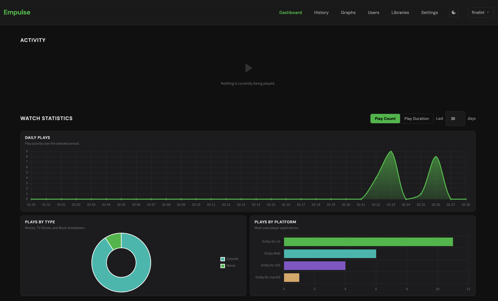

# Empulse

Activity monitoring dashboard for [Emby](https://emby.media) media servers. Track who's watching what, view playback history, graphs, and manage notifications.



## Quick Start

### Docker

1. Get your Emby API key in **Emby > Settings > API Keys**.
2. Copy `.env.example` to `.env` and set at least `EMBY_URL` and `EMBY_API_KEY`.
3. Start Empulse with Docker:

```bash
docker run -d \
  -p 8189:8189 \
  -v empulse-data:/app/data \
  -e EMBY_URL=http://your-emby-server:8096 \
  -e EMBY_API_KEY=your_api_key_here \
  -e DB_PATH=/app/data/empulse.db \
  ghcr.io/empul-dev/empulse:latest
```

Or with Docker Compose:

```bash
docker compose up -d
```

Open [http://localhost:8189](http://localhost:8189) in your browser.

Log in with your Emby username and password.

### Run Locally

#### Prerequisites

- Python `3.11+`
- `pip`
- A reachable Emby server
- An Emby API key for polling activity data

#### 1. Clone and create a virtual environment

```bash
git clone git@github.com:empul-dev/empulse.git
cd empulse
python3 -m venv .venv
source .venv/bin/activate
```

#### 2. Install dependencies

```bash
pip install -e ".[dev]"
```

#### 3. Configure environment variables

```bash
cp .env.example .env
```

Then edit `.env` and set:

- `EMBY_URL` to your Emby server URL, for example `http://localhost:8096`
- `EMBY_API_KEY` to an Emby API key with access to session data
- `AUTH_PASSWORD` if you want a local fallback admin password when Emby auth is unavailable

#### 4. Start the development server

```bash
uvicorn empulse.app:create_app --factory --reload --port 8189
```

Open [http://127.0.0.1:8189](http://127.0.0.1:8189) in your browser.

#### 5. Log in

- Primary login: your Emby username and password
- Fallback login: `AUTH_PASSWORD` from `.env`

If `AUTH_PASSWORD` is set, the login form still shows the Emby sign-in flow, but the password field also accepts the local fallback password. If Emby is down, Empulse falls back to `AUTH_PASSWORD` automatically.

## Configuration

All settings are via environment variables (in `.env` or `docker-compose.yml`):

| Variable | Default | Description |
|----------|---------|-------------|
| `EMBY_URL` | `http://localhost:8096` | Your Emby server URL |
| `EMBY_API_KEY` | *(required)* | Emby API key |
| `EMPULSE_PORT` | `8189` | Web UI port |
| `EMPULSE_HOST` | `127.0.0.1` | Bind address |
| `POLL_INTERVAL` | `10` | Seconds between Emby session polls |
| `DB_PATH` | `empulse.db` in the project directory | SQLite database path |
| `AUTH_PASSWORD` | *(optional)* | Fallback admin password (works when Emby is unreachable) |
| `SECRET_KEY` | auto-generated | Session signing key |
| `DISABLE_UPDATE_CHECK` | `false` | Set `true` to disable the automatic update checker |

## Troubleshooting

### `401` / redirect loop back to `/login`

- Make sure either `EMBY_API_KEY` or `AUTH_PASSWORD` is configured.
- Confirm you are using an Emby username/password pair, not the API key, in the login form.
- If you changed `.env`, restart Empulse.

### `Emby unavailable` or login fails when Emby is offline

- Verify `EMBY_URL` points to the Emby server from the machine running Empulse.
- If your Emby server is remote, confirm port `8096` or your custom port is reachable.
- Set `AUTH_PASSWORD` in `.env` if you want emergency local admin access while Emby is down.

### No activity appears in the dashboard

- Confirm `EMBY_API_KEY` is valid and belongs to the correct Emby server.
- Start playback in Emby and wait up to `POLL_INTERVAL` seconds for the first refresh.
- Check the server logs for connection or authentication errors.

### Changes in `.env` do not take effect

- Stop and restart the process after editing `.env`.
- For Docker Compose, run `docker compose up -d` again after changing environment variables.

### Sessions are lost after restart

- This is expected today. Empulse clears existing login sessions on startup, so you need to sign in again after each restart.

## Features

- **Live Activity** -- Active streams in real-time with player, quality, and transcode details
- **Stop Streams** -- Remotely stop active playback sessions
- **History** -- Full playback history with search, filtering, and sorting
- **Graphs** -- Daily/monthly play counts, watch heatmap, completion rates, bandwidth stats
- **Users / Libraries** -- Per-user and per-library statistics
- **Re-watch Detection** -- Tracks when content is watched again
- **Notifications** -- Discord, Telegram, email, ntfy, and webhook alerts
- **Newsletter** -- Scheduled email digests of recent activity

## Updating

Empulse checks for new releases daily and shows a banner on the Settings page when an update is available.

To update with Docker Compose:

```bash
docker compose pull && docker compose up -d
```

## Architecture

- **Backend**: Python / FastAPI / Uvicorn
- **Frontend**: Jinja2 templates, htmx, Chart.js
- **Database**: SQLite (auto-created on first run)
- **Deployment**: Docker (Python 3.13 Alpine)

## Development

```bash
# Run tests
pytest tests/

# Lint & format
ruff check empulse/
ruff format empulse/
```

## License

MIT
