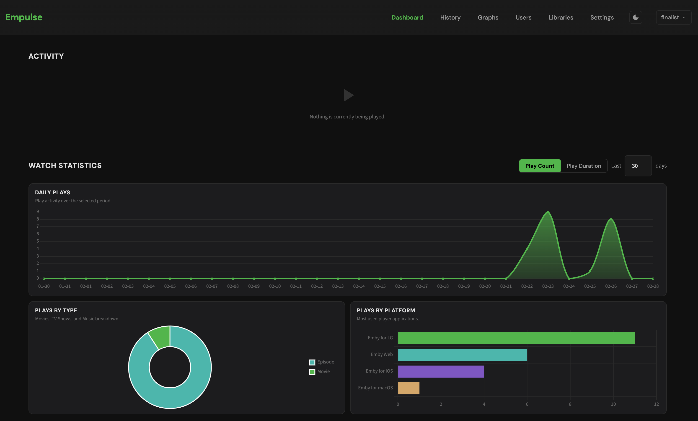

# Empulse

Activity monitoring dashboard for [Emby](https://emby.media) media servers. Track who's watching what, view playback history, graphs, and manage notifications.



## Quick Start

### Docker

1. Get your Emby API key in **Emby > Settings > API Keys**.
2. Copy `.env.example` to `.env` and set at least `EMBY_URL` and `EMBY_API_KEY`.
3. Start Empulse with Docker:

```bash
docker run -d \
  -p 8189:8189 \
  -v empulse-data:/app/data \
  -e EMBY_URL=http://your-emby-server:8096 \
  -e EMBY_API_KEY=your_api_key_here \
  -e DB_PATH=/app/data/empulse.db \
  ghcr.io/empul-dev/empulse:latest
```

Or with Docker Compose:

```bash
docker compose up -d
```

Open [http://localhost:8189](http://localhost:8189) in your browser.

Log in with your Emby username and password.

### Run Locally

#### Prerequisites

- Python `3.11+`
- `pip`
- A reachable Emby server
- An Emby API key for polling activity data

#### 1. Clone and create a virtual environment

```bash
git clone git@github.com:empul-dev/empulse.git
cd empulse
python3 -m venv .venv
source .venv/bin/activate
```

#### 2. Install dependencies

```bash
pip install -e ".[dev]"
```

#### 3. Configure environment variables

```bash
cp .env.example .env
```

Then edit `.env` and set:

- `EMBY_URL` to your Emby server URL, for example `http://localhost:8096`
- `EMBY_API_KEY` to an Emby API key with access to session data
- `AUTH_PASSWORD` if you want a local fallback admin password when Emby auth is unavailable

#### 4. Start the development server

```bash
uvicorn empulse.app:create_app --factory --reload --port 8189
```

Open [http://127.0.0.1:8189](http://127.0.0.1:8189) in your browser.

#### 5. Log in

- Primary login: your Emby username and password
- Fallback login: `AUTH_PASSWORD` from `.env`

If `AUTH_PASSWORD` is set, the login form still shows the Emby sign-in flow, but the password field also accepts the local fallback password. If Emby is down, Empulse falls back to `AUTH_PASSWORD` automatically.

## Configuration

All settings are via environment variables (in `.env` or `docker-compose.yml`):

| Variable | Default | Description |
|----------|---------|-------------|
| `EMBY_URL` | `http://localhost:8096` | Your Emby server URL |
| `EMBY_API_KEY` | *(required)* | Emby API key |
| `EMPULSE_PORT` | `8189` | Web UI port |
| `EMPULSE_HOST` | `127.0.0.1` | Bind address |
| `POLL_INTERVAL` | `10` | Seconds between Emby session polls |
| `DB_PATH` | `empulse.db` in the project directory | SQLite database path |
| `AUTH_PASSWORD` | *(optional)* | Fallback admin password (works when Emby is unreachable) |
| `SECRET_KEY` | auto-generated | Session signing key |
| `DISABLE_UPDATE_CHECK` | `false` | Set `true` to disable the automatic update checker |

## Troubleshooting

### `401` / redirect loop back to `/login`

- Make sure either `EMBY_API_KEY` or `AUTH_PASSWORD` is configured.
- Confirm you are using an Emby username/password pair, not the API key, in the login form.
- If you changed `.env`, restart Empulse.

### `Emby unavailable` or login fails when Emby is offline

- Verify `EMBY_URL` points to the Emby server from the machine running Empulse.
- If your Emby server is remote, confirm port `8096` or your custom port is reachable.
- Set `AUTH_PASSWORD` in `.env` if you want emergency local admin access while Emby is down.

### No activity appears in the dashboard

- Confirm `EMBY_API_KEY` is valid and belongs to the correct Emby server.
- Start playback in Emby and wait up to `POLL_INTERVAL` seconds for the first refresh.
- Check the server logs for connection or authentication errors.

### Changes in `.env` do not take effect

- Stop and restart the process after editing `.env`.
- For Docker Compose, run `docker compose up -d` again after changing environment variables.

### Sessions are lost after restart

- This is expected today. Empulse clears existing login sessions on startup, so you need to sign in again after each restart.

## Secrets & Key Rotation

Notification channel credentials (webhook URLs/headers, SMTP passwords, Telegram bot tokens, etc.) are encrypted at rest, using a key derived from `SECRET_KEY`. This means:

- Rotating `SECRET_KEY` (deleting `.empulse_secret` or changing the env var) invalidates previously-encrypted secrets — after rotating, re-enter credentials for any notification channels and the newsletter SMTP password.
- Session tokens are also signed with `SECRET_KEY`, so rotating it logs everyone out as well.

## Features

- **Live Activity** -- Active streams in real-time with player, quality, and transcode details
- **Stop Streams** -- Remotely stop active playback sessions
- **History** -- Full playback history with search, filtering, and sorting
- **Graphs** -- Daily/monthly play counts, watch heatmap, completion rates, bandwidth stats
- **Users / Libraries** -- Per-user and per-library statistics
- **Re-watch Detection** -- Tracks when content is watched again
- **Notifications** -- Discord, Telegram, email, ntfy, and webhook alerts
- **Newsletter** -- Scheduled email digests of recent activity

## Updating

Empulse checks for new releases daily and shows a banner on the Settings page when an update is available.

To update with Docker Compose:

```bash
docker compose pull && docker compose up -d
```

## Architecture

- **Backend**: Python / FastAPI / Uvicorn
- **Frontend**: Jinja2 templates, htmx, Chart.js
- **Database**: SQLite (auto-created on first run)
- **Deployment**: Docker (Python 3.13 Alpine)

## Development

```bash
# Run tests
pytest tests/

# Lint & format
ruff check empulse/
ruff format empulse/
```

## License

MIT

## Automatic update backups

Starting with 0.2.18, Empulse backs up an existing database before the first
startup with a different release version. This also covers databases from older
releases that have no version marker. A fresh installation and an ordinary
restart on the same version do not create a backup. Every release that changes
startup or database behavior must use a new version number.

Backups are stored beside the database under `backups/<database filename>/`.
With the supplied Compose configuration this is
`/app/data/backups/empulse.db/`, inside the persistent data volume. Each
`update-*` directory contains a verified SQLite snapshot and a manifest with the
source and target versions. If Empulse uses the generated `.empulse_secret`
file, it is included too. An externally configured `SECRET_KEY` must be retained
separately. Backups contain private data and credentials; their directory is
accessible only to the service user by default.

SQLite's backup API includes committed WAL data. The snapshot must pass checksum
and integrity checks before schema changes start. If the backup fails, startup
stops before migration. Schema changes, data migrations and the release marker
commit together; a migration error rolls them back. Background services start
only after database initialization succeeds.

Empulse keeps the latest three verified update backups by default. Set
`BACKUP_RETENTION` to another positive count if needed. Old backups are pruned
only after successful database initialization. Failed attempts with unchanged data reuse the
same verified backup. A retry still creates a temporary snapshot to check whether
an older release changed the data in the meantime. Allow room for the retained
backups, one temporary database copy, and SQLite's own working files. Invalid
backups are left for manual inspection rather than counted as usable copies.

### Restore after a failed update

Stop every Empulse container using the volume before restoring. Releases before
0.2.18 do not honor the new app/restore lock. Use the restore command from 0.2.18
or later even when the database will be used with an older release.

```bash
docker compose stop empulse
docker compose run --rm --no-deps --entrypoint python empulse \
  -m empulse.restore --db /app/data/empulse.db \
  /app/data/backups/empulse.db/update-REPLACE-WITH-BACKUP-NAME
```

The command validates the backup before replacing files, restores a bundled key,
and removes stale WAL/SHM files. It refuses to run while a cooperating Empulse
process holds the database lock. If you supplied `SECRET_KEY` externally, keep
its original value. Previous files are retained in a sibling
`empulse.db.before-restore-*` directory; these recovery copies are not removed
by automatic retention and can be deleted after confirming recovery.

Pin the Compose `image` to the version used before the failed update, for example
`ghcr.io/empul-dev/empulse:0.2.18`, then run `docker compose up -d empulse`.
The manifest's `source_version` identifies that release. `legacy` means the
source predates release tracking; use the image version you deployed previously.
Starting the newer image again would attempt the upgrade again.

If the restore process is interrupted, Empulse refuses to start while
`.empulse.db.restore-in-progress` exists. Keep all containers stopped. The marker
points to the rescue directory and `recovery.json`: copy the listed
`original_files` back into the database directory, remove only listed
`managed_files` that were not originally present, and remove the marker last.
This returns to the state before the restore attempt. Then retry the restore.

These local copies protect against failed updates. Back up the data volume to
another device or storage service as well to recover from volume or disk loss.
